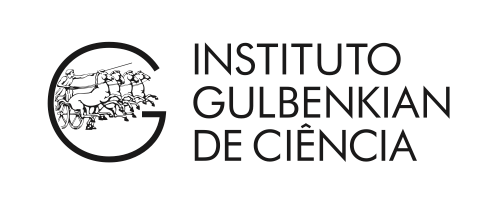
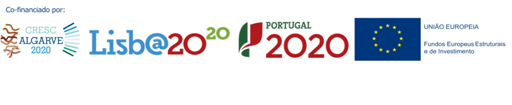

## Ready For BioData Management? Advanced DMPs

###  Instituto Gulbenkian de Ciência (IGC) - Oeiras, Portugal - January 29th 2020

---

#### Co-Authorship

The following co-authors contributed to the development of the training material.

* [Daniel Faria](https://github.com/DanFaria)
* [João Cardoso](https://github.com/JoaoMFCardoso)

#### Course Webpage
This is the link to the [course webpage](http://ready4biodatamanagement.biodata.pt/course.html), for further information about the course.

#### Code of Conduct
Please read the [CODE_OF_CONDUCT.md](./CODE_OF_CONDUCT.md) for details on contributing and reusing the training material.

#### License
This project is licensed under CC-BY 4.0 - see the [License.md](License.md) for details.

---

#### Host 

#### Contributors

---

[Github Pages](https://pages.github.com) provide a simple way to make a website using Markdown and git.

 

 Ready for BioData Management Advanced DMPs by BioData.pt is licensed under a <a rel="license" href="http://creativecommons.org/licenses/by/4.0/">Creative Commons Attribution 4.0 International License</a>.href="http://creativecommons.org/licenses/by/4.0/">Creative Commons Attribution 4.0 International License</a>.
