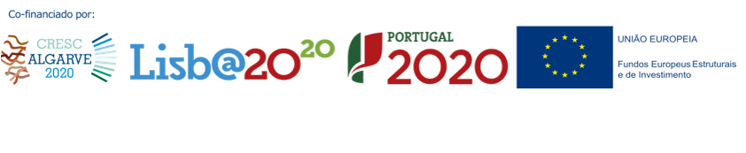

# Ready for BioData Management?

## Having trouble managing the biological data of your institution, laboratory, project or thesis?

Scientific data production is increasing at an exponential rate. Good data management practices and compliance with FAIR data principles are key to addressing this challenge.

This has been recognized by science funders and publishers who are now enforcing open science policies and adherence to the FAIR principles.

[**Ready for BioData Management?**](http://ready4biodatamanagement.biodata.pt/) is a capacity-building program in data management for the life sciences to empower researchers and institutions in managing their data more effectively and efficiently.

[**BioData.pt**](http://www.biodata.pt/) is currently offering the following courses:
* [Introduction to Data Management Plans](https://github.com/BioData-PT/Ready4BioDataManagement/tree/master/Intro%20to%20DMPs)
* [Advanced Data Management Plans](https://github.com/BioData-PT/Ready4BioDataManagement/tree/master/Advanced%20DMPs)

---
### Authors/Organizers
* [Daniel Faria](https://github.com/DanFaria) - co-organizer and co-author
* [João Cardoso](https://github.com/JoaoMFCardoso)  - co-organizer and co-author
* Marta Silva - graphic and web design

---
### Host

 
**Follow us:**&nbsp;&nbsp;&nbsp;&nbsp;&nbsp;&nbsp;

---

### License
 All **Ready for BioData Management?** materials are licensed under the  <a rel="license" href="http://creativecommons.org/licenses/by/4.0/">Creative Commons Attribution 4.0 International License</a>.

---
### Funding

